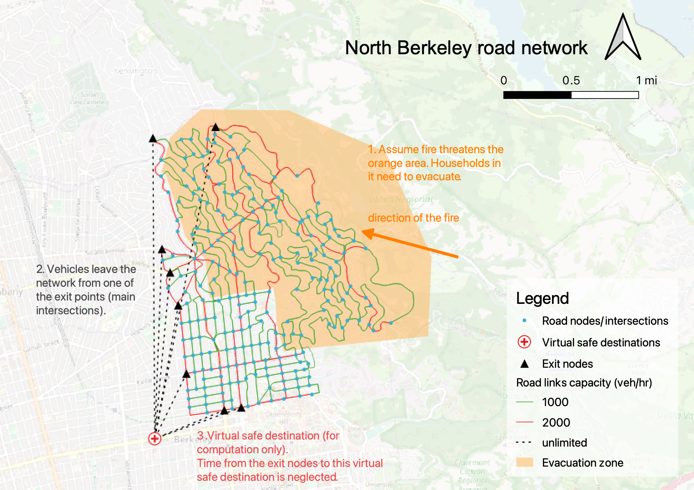

# Quiz 4

In this quiz, you will complete and run a simple python program that implements all-or-nothing traffic assignment. You will be provided with:
* road network input files: [berkeley_links.csv](https://raw.githubusercontent.com/UCB-CE170a/Fall2021/master/traffic_data/berkeley_links.csv) and [berkeley_nodes.csv](https://raw.githubusercontent.com/UCB-CE170a/Fall2021/master/traffic_data/berkeley_nodes.csv)
* origin-destination (OD) input file: [day_time_od.csv](https://raw.githubusercontent.com/UCB-CE170a/Fall2021/master/traffic_data/day_time_od.csv) and [night_time_od.csv](https://raw.githubusercontent.com/UCB-CE170a/Fall2021/master/traffic_data/night_time_od.csv). Trip origins and destinations are all nodes in the road network.

Below is a visualization of the input files and output files. As you can see, our study area covers mostly the north Berkeley. The orange area is a hypothesized evacuation zone. Depending on the housing density, there are a number of trips starting from each road network node inside the evacuation zone. The node titled "virtual safe destination" at the bottom left is a virtual supernode where all trips end.

The outcome you will need to obtain is:
* number of vehicles using each road link (traffic volume)

Save the output to a csv file titled `quiz4_yourname.csv` and submit it. The first few lines of your submission may look like the table below (numbers may be different).

| link_id | volume |
|---------|--------|
|8        |380     |
|26       |230     |
|31       |30      |
|38       |230     |
|52       |110     |

### submission
Submit `quiz4_yourname.csv` to bCourse by October 14, 2021 at 11:59pm.

Click the icon below to start:

