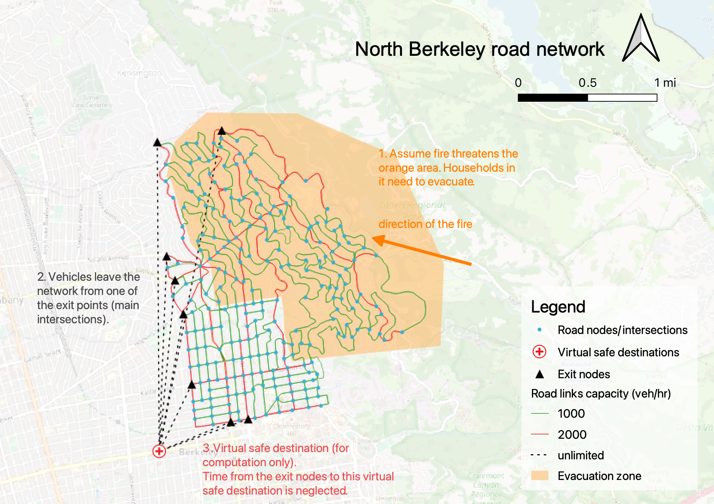

# Berkeley PATH Traffic Simulation Package

This package is intended to create an extensible package for creating custom traffic simulations and emergency analysis metrics.

This package is still in development. As such, PyPi might not have the most up-to-date benefits. Simply pull this repo and run `pip install cython && pip install .` 

Once installed a command-line tool called `gen` should become available. If `gen` works then the package is installed properly. Please install this package 
in a vitrual environment. Common errors during installation will be on installing `scipy` and `pandas`. If installation fails, try installing these
packages on your own in the virtual environment. 

This package is built as a tool for evaluating contraflow scenarios using a spatial queue based dynamic traffic assignment.
Here are some of the limitations of the package:

  - The evacuation demand is simply set as a "ratio" times the "numbers of residential parcels that are closest to the node". The ratio for the daytime evacuation demand is assumed to be 0.8, and 1.2 for the night time. A more realistic approach would be to obtain the vehicle ownership and travel perference data for the study area and then associate the demand to the origin nodes
  - It is assumed that all evacuees leave at time 0 (no staged/phased evacuation)
  - Background traffic (i.e., those that are not evacuation trips) is ignored. In reality, background traffic could potentially add more congestion and delays to the evacuation process
  - The rerouting frequency is set to 10800 seconds, which basically indicates that evacuees do not reroute (meaning they stick to their initial fastest path and not updating it even though the network condition has changed). You may want to vary this rerouting frequency parameter in the code for your report (but do not change it for the results submitted on October 19). Based on our experience, enable frequent rerouting is going to reduce the effectiveness of contraflowing during evacuation.
  - Agents (evacuees) are of identical size and speed. So trucks don't take up more space than cars. Nor do some cars go slower than others.
  - This queue is not parrelelized yet, so adding GPU's and CPU's won't speed up simulation (we are working on fixing this).

The package expects some key pieces of data and will assume certain parameters if they are not specified. First are our Nodes
and Links. This data is expected to be pulled from [OSM](https://www.openstreetmap.org) and should contain data as a 
csv. Our nodes csv should contain these columns `node_id,lon,lat,type,node_osmid` and our links csv should contain these 
columns `link_id,start_node_id,end_node_id,type,length,maxmph,lanes,capacity,fft,start_osmid,end_osmid,geometry`. 
Let's briefly go over what each column does and why we need it. The `node_id` is typically serially assigned and is a simple
index that we use for our computation. When analyzing OSM data you will be able to map physical intersections to our Node
representations by querying on `node_osmid`. A nodes `type` is used to distinguish between real nodes and virtual sinks (`vn_sinks`). Virtual sinks are ending nodes that should be placed and used for shortest paths calculations. They will be 
connected to virtual links and are used to record when a car has reached its destination. They are virtual beacuse we simply want to describe "safe zones" where evacuees can be considered to have reached their destination. 

Link capacity (1000 vehicles/(lane * hour)) will be automatically re-calculated each time you run the simulation. Link free-flow travel time, `fft`, is also calculated automatically by the code. If you specify the number of lanes to be 0 for a link, fft will be set to a very large number 1e8 so as to prevent the shortest path function from using it.

Next, we have our od csv. This is the travel demand file which is generated from parcel maps in Berkeley and reflects the fluctuations in the numbers of vehicles in the affected area during different times of day.

Finally we have our contraflow CSV which which is simply a two column csv of the particular link id that we want to 
modify and the number of new lanes we are adding (`link_id, new_lanes`)

The figure below shows our study area and the road network in North Berkeley. The red dots and blue lines are the road network nodes and links. In Berkeley, the west side (Berkeley Hills) has higher elevation and are covered by denser vegetation, while the east side (Downtown) is flatter and more urbanized. A wildfire is assumed to come from the east and all residents living in the orange area are ordered to evacuate. The road network node at the bottom left corner denotes a virtual safe destination, where all evacuees go.



## Usage
You can take a look ate our example note books [here](https://github.com/ucbtrans/BerkeleyTrafficSimPATH/tree/master/sim_package/examples) for default usages. For further customization, one can think about creating their own Node class by simply extending our given Node class (`from sim_package import Node, Link, etc.` ) and modifying the run node model function.
Here you can extend custom logic to implement stop signs, roundabouts, etc. Links can similiarly be modified to simulates crashes
sporadically or fire spread. Agents can be extended to implement different types of evacuees. Note that implementing these
custom features will be difficult as they will have some cascading effects on the simulation. So adding an intersection type
might involve some significant modifications to our Link logic as well. We are currently developing template classes as well
as trying to streamline the design of each class to minimize cross dependencies. 

We anticipate that most of our usage won't involve any modifications at all. Instead users can take advantage of our
high-level api in our Runner class or our command-line tool. The Runner class has the following instantiation.
```python
Runner(links_csv: str, nodes_csv: str, od_csv: str,
      contraflow_csv='',
      NodeClass=Node, LinkClass=Link, reroute_freq=10800) 
```
The csv arguments work as expected, but the you can additionally specify a reroute frequency and pass in your own custom
Node and Link classes. Just make sure the extend our base classes otherwise an assertion error will be thrown. 

Once the package is installed, you can also use our powerful cli tool that offers most of the customization as the runner 
class.
```bash
gen --nodes traffic_data/berkeley_nodes.csv --links traffic_data/berkeley_links.csv --ods traffic_data/day_time_od.csv --cf traffic_data_contraflow_scenario_1.csv   
```
When using the highlevel api it is important to note that it expects an output directory structure to exist as follows:
```bash
traffic_outputs
├── link_stats
├── node_stats
└── t_stats
```

For further usage details please type, `gen -h`. 

For any further suggestions or bugs, please.

### Dev Note
for arm64 machines (apple silicon), to install scipy this worked `pip install --pre -i https://pypi.anaconda.org/scipy-wheels-nightly/simple scipy`
